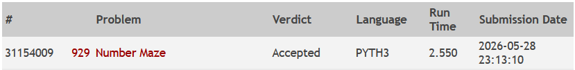

# UVA 929 - Number Maze

## Link
https://onlinejudge.org/index.php?option=com_onlinejudge&Itemid=8&page=submit_problem&problemid=870&category=0

## Integrantes do Grupo
- Victor Lins Gurgel do Amaral      - 2410448
- Gabriel de Sousa Nobre            - 2410399
- Lorenzo Barros Calheiros Pinheiro - 2410428

## Linguagem Utilizada
- Python

## Como Executar a Solução

A solução consome os dados através da entrada padrão (`sys.stdin`). Para executá-la, basta abrir o terminal na pasta raiz do projeto e redirecionar o arquivo de entrada desejado.

**No PowerShell (Windows):**
```powershell
Get-Content dados\entrada_do_problema.txt | python src\online_judge_otimizado.py
ou
cat dados\entrada_do_problema.txt | python src\online_judge_otimizado.py
```
**No Linux / macOS:**
```bash
cat dados/entrada_do_problema.txt | python3 src/online_judge_otimizado.py
```

## Modelagem do Problema e Representação Adotada
O problema foi modelado como um grafo direcionado e ponderado, onde:
* **Vértices:** Cada célula $(i, j)$ da matriz do labirinto representa um vértice.
* **Arestas e Pesos:** Cada vértice possui arestas direcionadas para os seus vizinhos ortogonais (cima, baixo, esquerda, direita). O **peso** (custo) de cada aresta para entrar em um vértice vizinho é exatamente o número contido na célula de destino.
* **Representação Adotada:** Para maximizar a performance e evitar a sobrecarga de memória gerada por matrizes 2D ou listas de adjacência pesadas, a matriz $N \times M$ fornecida pela entrada foi achatada em um único **Array 1D (Flat Array)**. O acesso aos vizinhos é feito por aritmética de índices (ex: o vizinho de baixo é encontrado somando o número total de colunas ao índice atual).

## Algoritmo Utilizado e Variações
* **Algoritmo Base:** Algoritmo de Dijkstra.
* **Variação Utilizada (Algoritmo de Dial):** Como o enunciado garante que os pesos das células variam estritamente entre $0$ e $9$, foi possível aplicar uma versão altamente otimizada do Dijkstra conhecida como **Algoritmo de Dial**. 
Nesta variação, descartamos a Fila de Prioridade baseada em *Binary Heap* (que teria custo de inserção **$\mathcal{O}(log V)$**) e adotamos o uso de **Buckets (Baldes)**. Criamos apenas 10 listas atuando como uma fila circular, reduzindo as operações de atualização e busca do próximo vértice mais próximo para o tempo constante de **$\mathcal{O}(1)$**. Apenas caminhos estritamente menores têm seus vizinhos adicionados aos buckets.

## Análise de Complexidade

Para analisarmos a complexidade de tempo (Big-O) das implementações, vamos primeiro definir as variáveis que compõem o problema:

*   **$T$**: Número de casos de teste.
*   **$V$**: Número total de vértices no labirinto. Como é uma matriz $N \times M$, temos **$V = N \times M$**.
*   **$E$**: Número total de arestas. Em um grid 2D onde andamos para cima, baixo, esquerda e direita, cada vértice tem no máximo 4 vizinhos. Logo, $E \approx 4V$. Portanto, podemos dizer que **$E = O(V)$**.
*   **$W$**: O peso máximo de uma célula (neste problema específico, os números variam de 0 a 9, então **$W = 9$**).

### 1. `main.py` (Dijkstra Tradicional com Fila de Prioridade)
**Big-O Total: $\mathcal{O}(T \times V \log V)$**

*   **Leitura e construção da matriz:** Percorrer os dados de entrada para montar o grid leva $\mathcal{O}(V)$.
*   **Fila de Prioridade (`heapq`):** No pior caso, o algoritmo insere e extrai vértices do `heapq`. A inserção/remoção em um *Binary Heap* custa $\mathcal{O}(\log V)$.
*   Como processamos até $E$ vizinhos e os adicionamos à fila, o custo do laço principal do Dijkstra é $\mathcal{O}(E \log V)$.
*   Sabendo que $E \approx 4V$, o custo de cada caso de teste se simplifica para $\mathcal{O}(V \log V)$.
*   Multiplicando pelo número de casos de teste $T$, chegamos à complexidade final.

### 2. `online_judge_otimizado.py` (Algoritmo de Dial / Fast I/O)
**Big-O Total: $\mathcal{O}(T \times V)$** *(Complexidade Linear)*

*   **Leitura Rápida (Fast I/O):** A leitura usando `sys.stdin.read().split()` processa a entrada inteira de uma só vez. Fazer o parser de todo o texto leva $\mathcal{O}(T \times V)$.
*   **Algoritmo de Dial:** Em vez de usar um `heapq` que custa $\log V$ por operação, o código utiliza 10 listas (buckets) simulando uma fila circular. 
*   Inserir um elemento num bucket (`append`) custa $\mathcal{O}(1)$.
*   Remover um elemento de um bucket (`pop`) custa $\mathcal{O}(1)$.
*   O algoritmo gasta um pequeno tempo extra avançando o cursor de distância `d` para achar o próximo bucket não vazio. No pior dos casos, esse cursor avança até a distância máxima possível, que é limitada por $V \times W$.
*   A complexidade teórica do algoritmo de Dial para um único caso de teste é $\mathcal{O}(E + V \times W)$. Como $E \approx 4V$ e $W = 9$ (uma constante muito pequena), a equação vira $\mathcal{O}(4V + 9V) = \mathcal{O}(13V)$, que na notação Big-O é simplificada para **$\mathcal{O}(V)$**.

### Complexidade de Espaço (Memória)
**Big-O Total: $\mathcal{O}(V)$**

A estrutura dominante de memória na nossa solução otimizada é o armazenamento das células do labirinto e de suas distâncias mínimas. Como transformamos a matriz bidimensional em um Flat Array, utilizamos uma lista `grid` de tamanho $V$ e um array de distâncias `_dist` de tamanho $V$. A fila de prioridade baseada em `buckets` ocupa espaço máximo proporcional à quantidade de vértices na fila (limitado a $V$). Portanto, a complexidade de espaço é estritamente linear: **$\mathcal{O}(V)$**.

## Evidência de Accepted
Abaixo encontra-se a comprovação de que a solução foi aceita nos limites de tempo do URI Online Judge:


